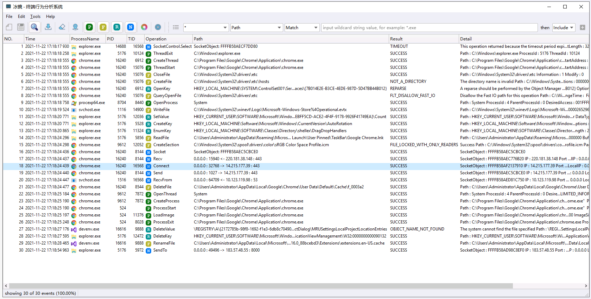
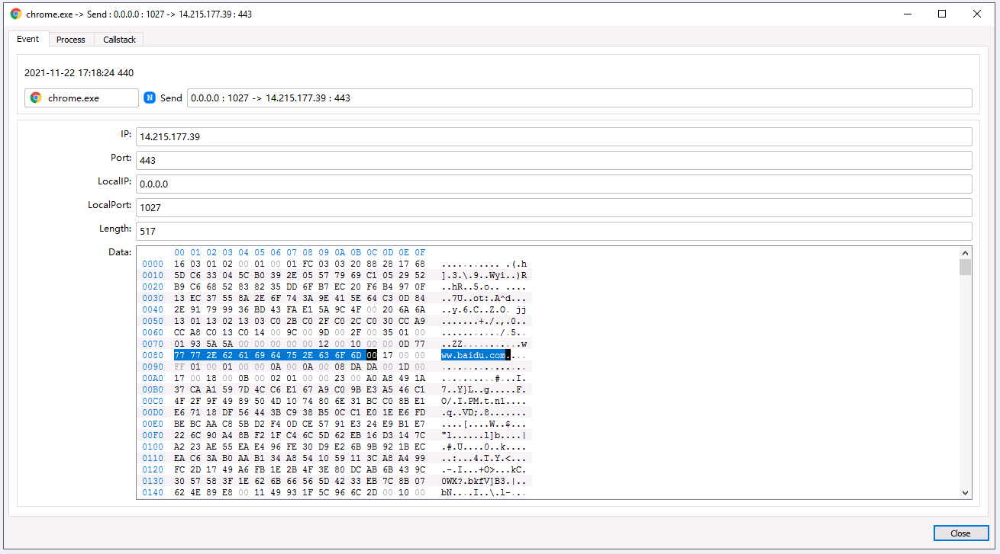
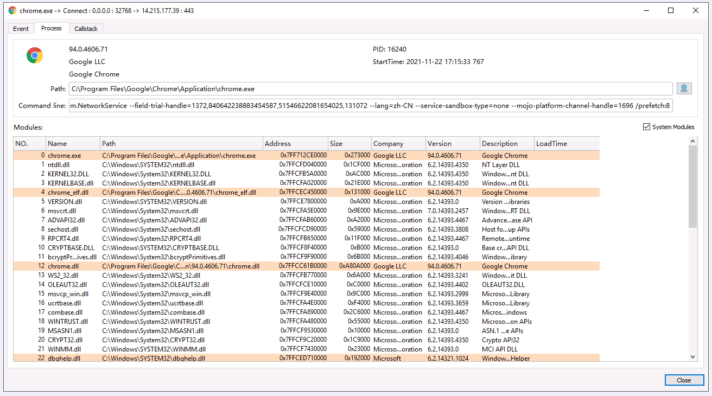
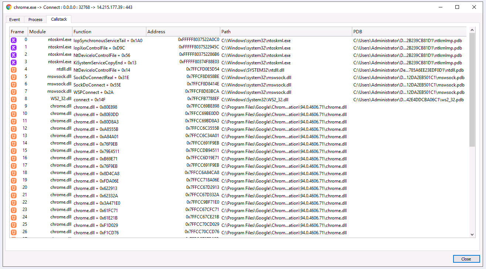
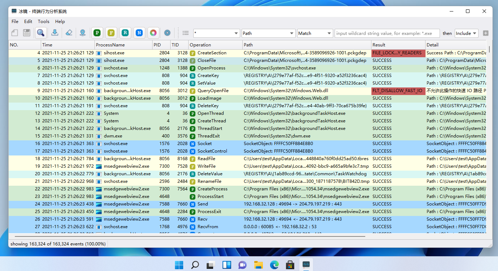

English|  [简体中文](./README-zh_CN.md) 

iMonitor (Endpoint Behavior Analysis System - Then **Open Source Procmon**) is a endpoint behavior monitoring and analysis software based on [iMonitorSDK](https://github.com/wecooperate/iMonitorSDK).

Provides monitoring of system behaviors such as processes, files, registry, and networks. Support extensions and scripts, you can easily customize and add more functions. It can be used for virus analysis, software reverse engineering, intrusion detection, EDR, etc.

## Some features

- Open source
- Support 32-bit and 64-bit systems from Win7 to Win11 (Because Qt uses a newer version and does not support XP, you can replace it with a Qt version that supports XP if you need to support it)
- Support rich behavior monitoring, process open events, and various operation events of sockets
- Support filter conditions for each event field and filter conditions for stack modules
- **All behaviors monitored by iMonitor can be blocked by [iMonitorSDK](https://github.com/wecooperate/iMonitorSDK), [iDefender](https://github.com/wecooperate/iDefender)**
- **Support scripting and application market, unlimited expansion and customization functions (to be supported)**

## Source code compilation

- VS2019 and above environment is required
- CMake 3.10 or later is required
- Qt5.12 needs to be installed (multi-language support by default, qtlinguistinstaller needs to be installed at the same time)
- Execute build.bat in the directory (this step will prompt to set the installation path of QT, follow the prompts to set environment variables)

## Screenshots

Event details

Win11

## Plan

- Complete basic functions
  - [ ] Support data saving and loading
  - [ ] Support rule saving, rule list
  - [ ] Support process, file, registry, network information summary
  - [ ] Support search, quick filter, label
  - [ ] Column supports customization, editing, display and hide
  - [ ] Improve QSS and internationalization

- Plugin extension
  - [ ] Support plugin extension
  - [ ] Support script extension
  - [ ] Key plugin
    - [ ] Filter plugin: support more complex condition filtering
    - [ ] Display plugin: add more information display
    - [ ] Behavior plugin: you can analyze the meaning of each path
    - [ ] Security plugin: According to the weight of the behavior, intelligently analyze the virus behavior
    - [ ] Reverse plugin: automatically filter out the system path, quickly analyze which data is stored and modified by a software
  - [ ] Development platform-Application market support

- Detection analysis and response
  - [ ] Combined with the iDefender active defense system, quickly disable the detected behavior
  - [ ] Data support report integration into EDR, SOC, SIEM and other platforms

## About Us

Excellent people do professional things.

Wecooperate Technology is an enterprise dedicated to providing basic services and an integrated management platform for enterprise management, striving to become the entrance to enterprise management and promoting the standardization and digitization of enterprise management. Our goal is to reject involution and let everyone work and live better.

Our members are top talents from companies such as Kingsoft, 360, Tencent, etc., with deep technical skills. A number of core products are under development and require various talents and capital investment.

[Contact Us](mailto://iMonitor@qq.com)
