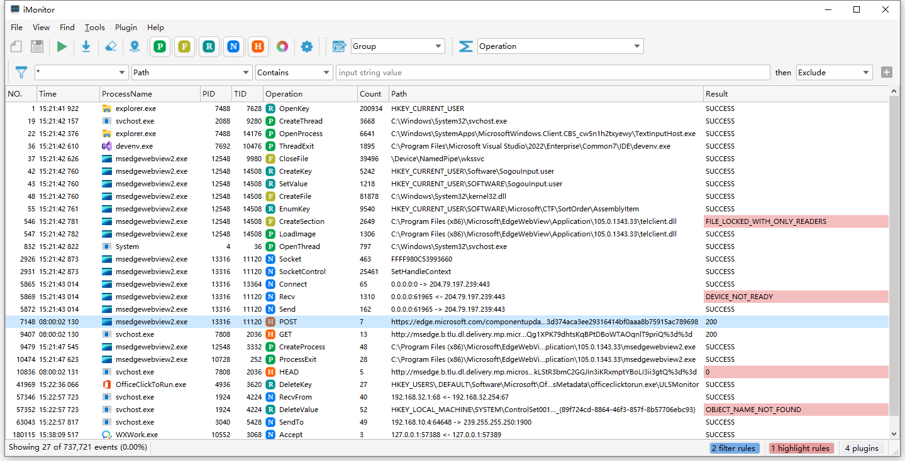
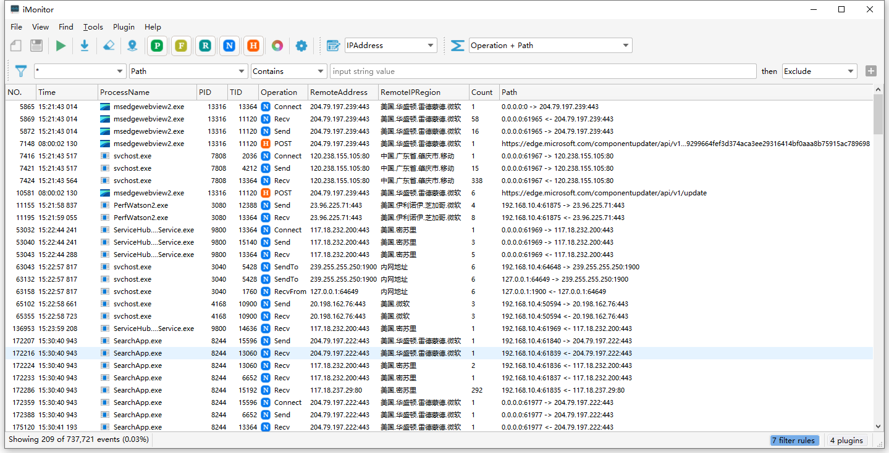

[中文](./README_zh.md)

## Introduction

iMonitor (Endpoint Behavior Analysis System) is a endpoint behavior monitoring and analysis software based on [iMonitorSDK](https://iMonitorSDK.com).

Provides monitoring of system behaviors such as processes, files, registry, and networks. Support extensions and scripts, you can easily customize and add more functions. It can be used for virus analysis, software reverse engineering, intrusion detection, EDR, etc.

## Screenshots

## Version
### 2.2.0（2022.10.30）

- **Add scripting support** (you can use scripts to extend columns, customize matchers) Detailed reference [Script Development Guide](ttps://imonitorsdk.com/imonitor/script)
- Optimized several user experiences
- Fixed some minor issues

### 2.1.1（2022.10.7）

- Adjust the priority of grouping and filtering (previously grouped and then filtered, now filtered before grouping)
- Fixed the issue where selecting columns caused the crash

### 2.1（2022.10.5）

- Added event snapshot support
  - Snapshot support sorting
- Add dynamic library load analysis (Properties - Dependency)
  - It can be analyzed that DLLs are lost and that DLLs are at risk of being hijacked
- Fixed a crash caused by finding any column

Thanks to sagasm for your feedback.

### 2.0（2022.09.14）

- Add the management of display columns, you can customize the data to be displayed

- Added highlight function, which can highlight key data

- Supports grouping and merging statistics, which greatly improves the convenience of analysis (similar to the GROUP BY effect in SQL)

- Add workspace management, different analysis scenarios can be quickly switched through the workspace

- Added find function

- Add multi-language support

- Add more event support

  - Add support for named pipes
  - Add HTTP, HTTPS support

- Add plugin support

  - Support for custom columns
  - Support custom rule matching
  - Support interface interaction (requires Qt dependency)

- Built-in some plugins

  - Add IP address attribution column
  - Add a column of path information that can be displayed by custom rules
  - Added column for process sensitive behavior description
  - Added quick rule matching if it is a document

- Miscellaneous

  - Added support for discarding filtered rules
  - Support switching between highlighting rules and filtering rules
  - The method of adding incremental filtering to rule matching, no longer requires full matching when adding rules
  - Add regular expression support for matching rules
  - Columns and rules support modifying default values
  - Add installation package
  
  ### 1.0（2022.03.14）