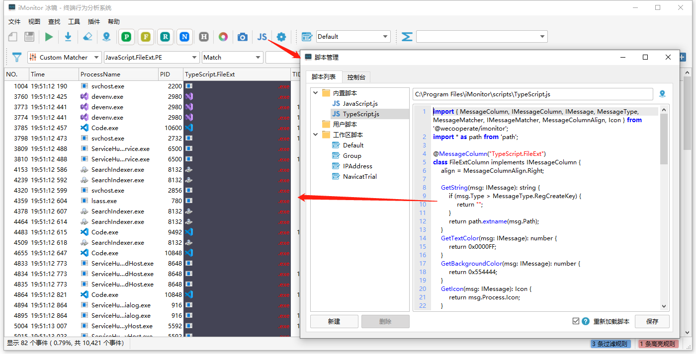

## @wecooperate/imonitor

@wecooperate/imonitor 是 [iMonitor（冰镜）](https://imonitorsdk.com/imonitor)的TypeScript扩展声明库。

### 快速开始

```typescript
import { MessageColumn, IMessageColumn, IMessage, MessageType, MessageMatcher, IMessageMatcher, MessageColumnAlign, Icon } from '@wecooperate/imonitor';
import * as path from 'path';

@MessageColumn("TypeScript.FileExt")
class FileExtColumn implements IMessageColumn {
    align = MessageColumnAlign.Right;

    GetString(msg: IMessage): string {
        if (msg.Type > MessageType.RegCreateKey) {
            return "";
        }
        return path.extname(msg.Path);
    }
    GetTextColor(msg: IMessage): number {
        return 0x0000FF;
    }
    GetBackgroundColor(msg: IMessage): number {
        return 0x554444;
    }
    GetIcon(msg: IMessage): Icon {
        return msg.Process.Icon;
    }
}

@MessageMatcher("TypeScript.FileExt.PE")
class FileExtMatcher implements IMessageMatcher {
    IsMatch(msg: IMessage): boolean {
        if (msg.Type > MessageType.RegCreateKey) {
            return false;
        }
        let ext = path.extname(msg.Path).toLowerCase();
        return ext === '.exe' || ext === ".dll" || ext === ".sys";
    }
}
```

将上面的代码通过TypeScript的Playground功能，可以快速生成JavaScript代码。 [TypeScript Playground](https://www.typescriptlang.org/play?ssl=34&ssc=2&pln=1&pc=1#code/JYWwDg9gTgLgBAbzgWQKYGd0EMDmqDCEANgK4gB2ANHAJJqa4HFlW33Z7XuMAqAnmFRcMHVMiwwAxgAtUUanRGNxU2fJRK8hUhQCCRYDlY1JEcnAC+cAGZQIIOAHIAAgHdUpiIKgTUAelAzYBhoRwBuAFgAKFBIWDgAKjgsdDgwCWkbOwdHdJhpcOjo524tZgoACgAifkEAZUkoYDAYADoAMWAiVABRAA8YKoBKaMkiFNTO7v6YbRY4WO6QVHIYVMUGMp1zBGi4feSDIzgAXg1Npm39Q3JWgCVDaRhIqL2DgHFUGDqYJvIcCogdA4ABcbE0qCGYPQv2A-0QbwOB2A1jggOBrVqqDgAD5zqIsfdUDh8FBUL4ANKoPhDBFRJEMg5kmAkKDmKpVF6M-YWREM5ms8x5aStVADchYZbonCtAAKGSGXIOvPpHy+PDFs2I0GlYI2oihcHIZAARnI6dy4AK2XAAAx9W2O23tdpKnl8z4wABCWEkAGscHYSOQACbaHVA0Hgi6G40gM1QC3c63me0AVjTABZs5m3ZYPV8TGZddGDXrTDs+UiU3BI3K7JIRK0i+Q8yqVcVSmIJDI5NUsQ0mi0Ol1egM5T1hqNxpg4FMxzAVL3E4tUMtVusu0u1En9jR0NuS-rGIaTRBiOTK6rGSi0XWsbj8bwBKgiSSyZTqbTdtfLVavoKNhYEQ6CoHmSIqpa3TwJqpxpBkoripKqDSnKCqtCEAAyEDuFA+ApChipVkyAE2rBJwUU4iGoI4cAAD50XA5GUVUrQhkQRBVPRjHMWcrHoHw6Ccny7bREAA)

脚本加载后使用效果如下：



更多使用可以参考examples目录。

### 添加一个列

1. 继承实现IMessageColumn
2. 通过RegisterMessageColumn注册（如果使用typescript，可以用装饰器的方式 @MessageColumn）

```typescript
export interface IMessageColumn {
    align?: MessageColumnAlign;
    width?: number;
    description?: string;

    GetString(msg: IMessage): string;

    GetToolTips?(msg: IMessage): string;
    GetTextColor?(msg: IMessage): number;
    GetBackgroundColor?(msg: IMessage): number;
    GetIcon?(msg: IMessage): Icon;
}
```

| 成员               | 说明                                                         | 是否必须 |
| ------------------ | ------------------------------------------------------------ | -------- |
| GetString          | 返回列显示的字符串                                           | 是       |
| GetToolTips        | 返回鼠标hover到列显示的ToolTips                              | 否       |
| GetBackgroundColor | 返回列的背景颜色                                             | 否       |
| GetTextColor       | 返回列的文字颜色                                             | 否       |
| GetIcon            | 返回列的图标（Icon目前只支持获取进程Icon，未来会添加加载文件Icon） | 否       |
| align              | 列对齐方式（靠左、居中、靠右），默认靠左对齐                 | 否       |
| width              | 列初始化的宽度                                               |          |
| description        | 列信息描述说明                                               |          |

### 添加一个自定义规则匹配器


1. 继承实现IMessageMatcher
2. 通过RegisterMessageMatcher注册（如果使用typescript，可以用装饰器的方式 @MessageMatcher）

```typescript
export interface IMessageMatcher {
    description?: string;
    
    IsMatch(msg: IMessage): boolean;
}
```

| 成员        | 说明             | 是否必须 |
| ----------- | ---------------- | -------- |
| IsMatch     | 返回是否匹配     | 是       |
| description | 匹配器的描述说明 | 否       |
